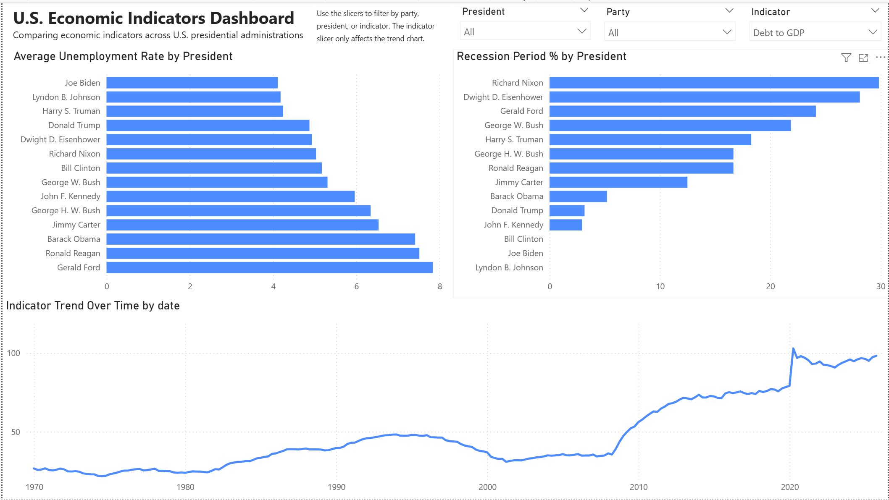

# U.S. Economic Indicators Dashboard

## Skills Showcase
This project demonstrates my ability to collect public data with Python, clean and structure it for analysis, model it in PostgreSQL, write SQL queries for comparison and trend analysis, and build an interactive Power BI dashboard. It reflects my ability to work through a full analytics workflow from raw data to final presentation.

## Introduction
This is an end-to-end data project where I used Python, SQL, and Power BI to explore major U.S. economic indicators over time. My goal was to build something that felt like a real analyst project from start to finish by collecting public data, cleaning it, storing it in a database, analyzing it with SQL, and presenting it in an interactive dashboard.

The dashboard focuses on how key economic indicators changed across U.S. presidential administrations and allows users to filter by party, president, and indicator.

## Dashboard Preview



## Background
I created this project to practice combining the three main tools I am actively learning:

- Python for data collection and cleaning
- SQL for data modeling and analysis
- Power BI for dashboard development

I wanted a project that would help me go beyond building charts and work through the full process:
- pulling data
- cleaning data
- modeling data
- analyzing data
- building a dashboard

I chose U.S. economic indicators because they are public, meaningful, and work well for time-based analysis. I also wanted to compare how different indicators looked during Democratic and Republican administrations while keeping the analysis descriptive rather than making causal claims.

## Data Sources
This project uses public economic data from the Federal Reserve Economic Data (FRED) platform.

Version 1 includes these indicators:
- **Real GDP** (`GDPC1`)
- **Unemployment Rate** (`UNRATE`)
- **CPI, All Items** (`CPIAUCSL`)
- **Federal Funds Rate** (`FEDFUNDS`)
- **S&P 500** (`SP500`)
- **Recession Indicator** (`USREC`)
- **Debt to GDP** (`FYGFGDQ188S`)

Presidential administration dates were compiled into a separate administration reference file and used to assign each data point to the president and party in office at that time.

## Tools I Used
**Python**  
I used Python to pull data from public sources and clean it into a structured format that could be loaded into SQL.

**PostgreSQL**  
I used PostgreSQL to build the data model, load the cleaned data, and write analysis queries.

**Power BI**  
I used Power BI to create the interactive dashboard and build visuals that compare indicators by president and party.

**VS Code**  
I used VS Code for writing and running both Python and SQL.

## The Analysis
In the SQL portion of the project, I explored questions like:
- How many rows exist for each indicator?
- What was the average unemployment rate by president?
- What percentage of each presidency took place during recession periods?
- What was the average unemployment rate by party?
- How did major indicators vary across administrations?

These analysis steps helped me validate the dataset and directly informed the visuals used in the Power BI dashboard.

## Dashboard Features
The Power BI dashboard includes:
- **Average Unemployment Rate by President**
- **Recession Period % by President**
- **Indicator Trend Over Time**
- **Party slicer**
- **President slicer**
- **Indicator slicer**

The indicator slicer controls the trend chart so users can focus on one indicator at a time. The party and president slicers allow users to narrow the dashboard to specific administrations.

## What I Learned
This project helped me strengthen several important skills:

- pulling and cleaning public economic data with Python
- organizing time-series data for analysis
- building fact and dimension tables in PostgreSQL
- writing SQL queries for grouped comparisons
- creating DAX measures in Power BI
- designing slicer behavior and visual interactions
- thinking more carefully about how to present time-series data clearly

One thing I learned quickly is that not all indicators should be placed on the same chart at the same time. Indicators like GDP, unemployment, recession flags, and the S&P 500 operate on very different scales, so it is much more effective to let the user focus on one indicator at a time in the trend view.

## Conclusions
This project gave me hands-on practice with the full analytics workflow using public data. It helped me get more comfortable moving between Python, SQL, and Power BI in one connected project and reinforced the importance of building clean, user-friendly dashboards.

The final result is an interactive dashboard that allows users to explore economic trends across presidential administrations while keeping the analysis descriptive, visual, and easy to follow.

## Transparency Statement
This project is part of my learning journey toward becoming a data analyst.

I built this project as hands-on practice using public economic data. I worked through the data collection, cleaning, SQL modeling, analysis queries, and Power BI dashboard development as part of my own learning process.

ChatGPT was used as a learning and productivity tool to help me troubleshoot issues, understand concepts, and structure parts of the project more clearly.

## Project Structure
```text
US_Economic_Indicators_Project/
│
├── data/
│   ├── raw/
│   └── cleaned/
│
├── docs/
│   └── dashboard_overview.png
│
├── powerbi/
│   └── US_Economic_Indicators_Dashboard.pbix
│
├── python/
│   ├── config.py
│   ├── pull_fred_data.py
│   └── clean_data.py
│
├── sql/
│   ├── create_tables.sql
│   ├── load_data.sql
│   └── analysis_queries.sql
│
├── requirements.txt
└── README.md